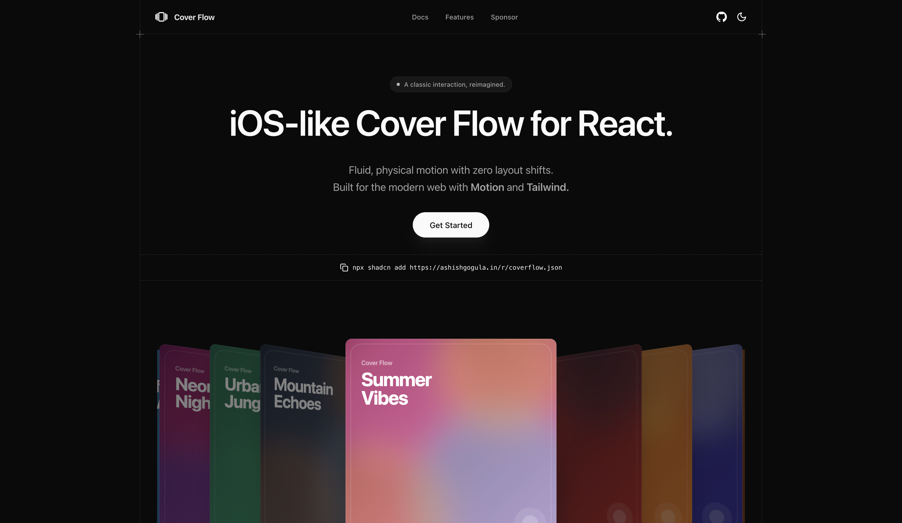

# Cover Flow

A high-fidelity recreation of the classic iTunes Cover Flow interaction, built for the modern web using React, Next.js, and Motion.




[](https://opensource.org/licenses/MIT)
[](https://nextjs.org/)
[](https://motion.dev/)
[](https://tailwindcss.com/)

## Overview

Cover Flow is a production-ready 3D carousel component that mimics the physical feel of the original Apple interface. It uses spring physics for fluid, interruptible motion and is built with a focus on performance (buttery-smooth animations on modern high-refresh displays), accessibility, and zero layout shifts.

Designed to be dropped into any React/Next.js application, it supports both mouse/touch interactions and keyboard navigation.

## Features

- **Fluid Physics Engine**: Driven by `motion` (framer-motion) springs. Motion is weighty, responsive, and fully interruptible.
- **3D Transforms**: Uses CSS 3D transforms with hardware acceleration for buttery smooth performance.
- **Interactive**: Supports 1:1 touch/drag gestures with velocity-aware throwing and keyboard navigation (Left/Right arrows).
- **Responsive**: Fully responsive and adaptable to different container sizes.
- **Dark Mode Ready**: Built with Tailwind CSS and fully compatible with `next-themes`.
- **Zero Layout Shift**: Isolated component design prevents surrounding layout jitter.

## Installation

### CLI (Recommended)

You can install the component directly into your project using the shadcn CLI:

```bash
npx shadcn add https://coverflow.ashishgogula.in/r/coverflow.json
```

### Package Manager

Alternatively, you can install the primitive package:

```bash
npm install @ashishgogula/coverflow
# or
pnpm add @ashishgogula/coverflow
# or
yarn add @ashishgogula/coverflow
# or
bun add @ashishgogula/coverflow
```

### Manual Installation

1.  **Install dependencies**:

    ```bash
    npm install motion
    ```

2.  **Copy the code**:
    Copy the source code from `registry/coverflow/coverflow.tsx` into your project's component directory.

## Usage

Import the component and pass an array of items to display.

```tsx
import { CoverFlow } from "@/components/coverflow";

const items = [
  { id: 1, image: "/images/album1.jpg", title: "Album Title 1" },
  { id: 2, image: "/images/album2.jpg", title: "Album Title 2" },
  { id: 3, image: "/images/album3.jpg", title: "Album Title 3" },
];

export default function MyPage() {
  return (
    <div className="h-[500px] w-full bg-black relative">
      <CoverFlow 
        items={items} 
        itemWidth={250} 
        itemHeight={250}
        initialIndex={1}
        enableReflection={true}
      />
    </div>
  );
}
```

## Props

| Prop | Type | Default | Description |
| :--- | :--- | :--- | :--- |
| `items` | `CoverFlowItem[]` | Required | Array of items to display. Each item must have `id`, `image`, and `title`. |
| `itemWidth` | `number` | `400` | Width of each card in pixels. |
| `itemHeight` | `number` | `400` | Height of each card in pixels. |
| `stackSpacing` | `number` | `100` | Spacing between stacked cards (cards on the side). |
| `centerGap` | `number` | `250` | Gap between the center card and the side stacks. |
| `rotation` | `number` | `50` | Rotation angle (in degrees) for stacked cards. |
| `initialIndex` | `number` | `0` | The index of the item to show initially. |
| `enableReflection` | `boolean` | `false` | Whether to show the reflection effect below cards. |

## Tech Stack

- **Framework**: [Next.js 16](https://nextjs.org/) (App Router)
- **Animation**: [Motion](https://motion.dev/)
- **Styling**: [Tailwind CSS](https://tailwindcss.com/)
- **Icons**: [Lucide React](https://lucide.dev/)

## website

[coverflow.ashishgogula.in](https://coverflow.ashishgogula.in)

## License

MIT © [Ashish Gogula](https://github.com/ashishgogula)
