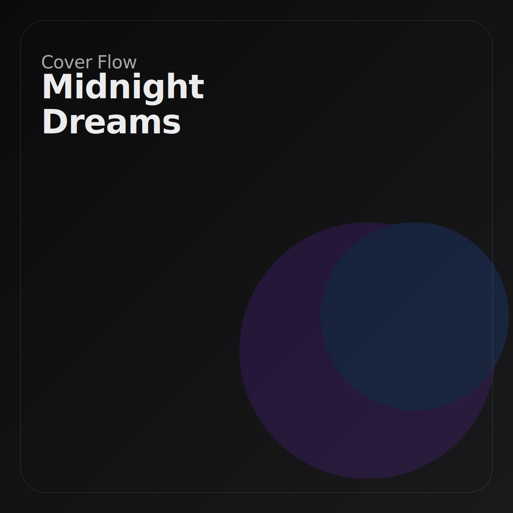

# Cover Flow

A high-fidelity recreation of the classic iTunes Cover Flow interaction, built for the modern web using React, Next.js, and Motion.



## Overview

This project implements a 3D carousel component that mimics the physical feel of the original Cover Flow. It uses spring physics for fluid, interruptible motion and is built with a focus on performance (60fps), accessibility, and zero layout shifts.

The landing page features a "Bento Grid" layout to showcase features, adhering to a premium, Apple-inspired design aesthetic.

## Features

- **Fluid Physics Engine**: Driven by `motion` (framer-motion) springs, not linear timelines. Motion is weighty, responsive, and fully interruptible.
- **3D Transforms**: Uses CSS 3D transforms with hardware acceleration (`will-change-transform`) for buttery smooth performance.
- **Keyboard Navigation**: Full arrow key support (`Left` / `Right`) for accessibility.
- **Touch & Drag**: 1:1 gesture tracking with velocity-aware throwing on touch devices.
- **Zero Layout Shift**: The component is isolated to prevent surrounding layout jitter during interaction.
- **Dark Mode Native**: First-class support for light and dark themes using `next-themes`.
- **Semantic Design**: Built with a custom semantic CSS system (`marketing.css`) avoiding utility soup.

## Tech Stack

- **Framework**: [Next.js 15](https://nextjs.org/) (App Router)
- **Animation**: [Motion](https://motion.dev/) (formerly Framer Motion)
- **Styling**: [Tailwind CSS](https://tailwindcss.com/)
- **Icons**: [Lucide React](https://lucide.dev/)
- **Theming**: [next-themes](https://github.com/pacocoursey/next-themes)

## Getting Started

### Prerequisites

- Node.js 18+
- npm, yarn, or pnpm

### Installation

1. Clone the repository:
   ```bash
   git clone https://github.com/your-username/coverflow.git
   cd coverflow
   ```

2. Install dependencies:
   ```bash
   npm install
   # or
   yarn install
   # or
   pnpm install
   ```

3. Run the development server:
   ```bash
   npm run dev
   ```

4. Open [http://localhost:3000](http://localhost:3000) with your browser to see the result.

## Usage

To use the `CoverFlow` component in your own project, import it and pass an array of items:

```tsx
import { CoverFlow } from "@/components/coverflow";

const items = [
  { id: 1, image: "/path/to/image1.jpg", title: "Album 1", subtitle: "Artist 1" },
  { id: 2, image: "/path/to/image2.jpg", title: "Album 2", subtitle: "Artist 2" },
  // ...
];

export default function MyPage() {
  return (
    <div className="h-[500px] w-full">
      <CoverFlow 
        items={items} 
        itemWidth={400} 
        itemHeight={400} 
      />
    </div>
  );
}
```

## Project Structure

```
.
├── app/
│   ├── globals.css      # Base Tailwind and theme variables
│   ├── marketing.css    # Semantic design system & Bento grid styles
│   ├── layout.tsx       # Root layout with ThemeProvider
│   └── page.tsx         # Landing page demo
├── components/
│   ├── coverflow.tsx    # Core 3D carousel component
│   ├── theme-provider.tsx
│   └── theme-toggle.tsx
├── public/
│   └── covers/          # SVG assets for demo
└── ...
```

## License

MIT
